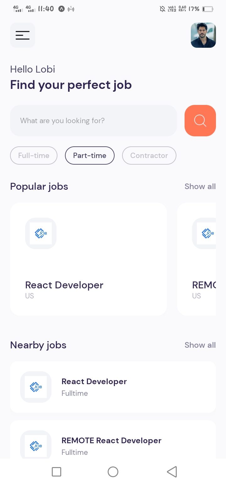
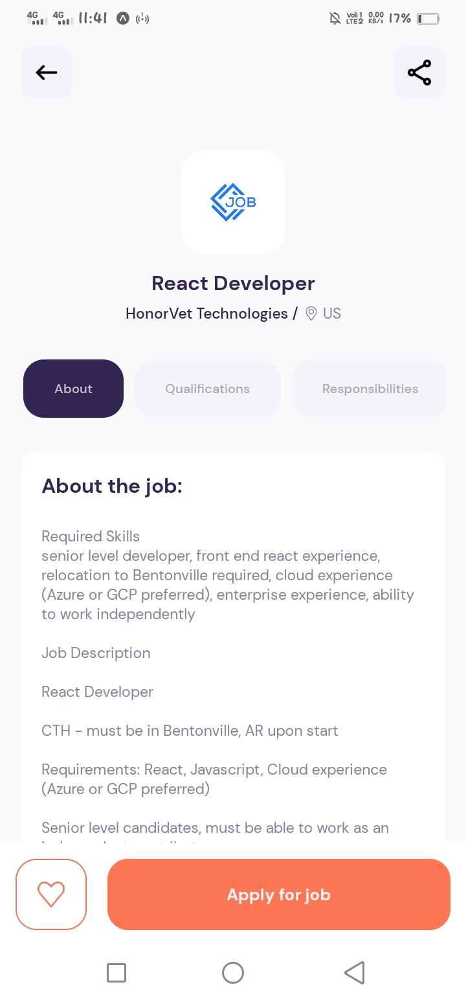
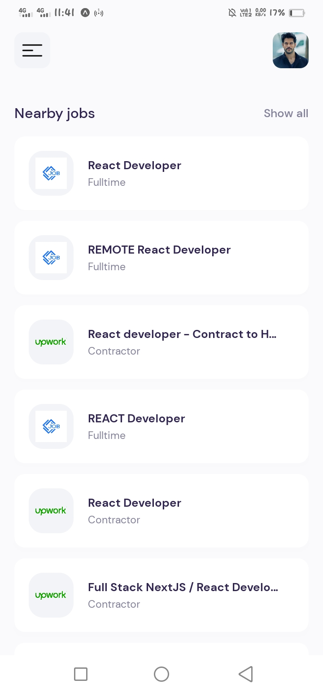
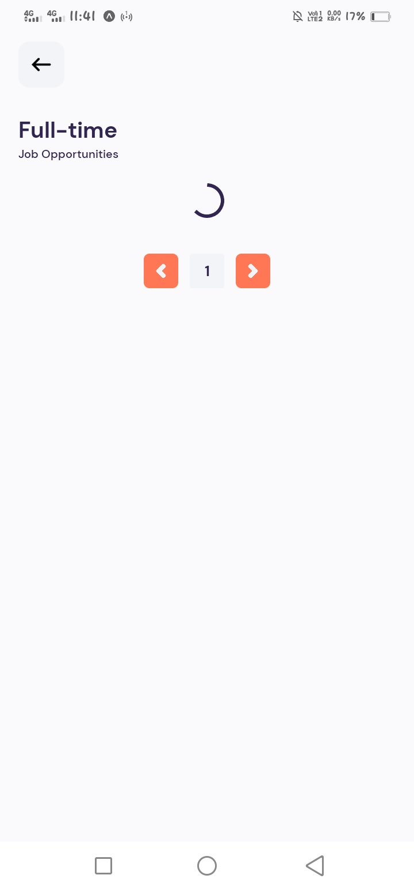

<h1 align="center">
  Job App
</h1>

<h3 align="center" fontFamily="cursive">
  <a href="https://drive.google.com/file/d/1jA0Lh78Xvxnh_G878-yQJ7itik3QB4BF/view?usp=sharing">
    click here for demo video
  </a>
</h3>
## About

<table>
<tr>
<td>
Discover your dream job with our React Native app! Access a vast database of job listings powered by RapidAPI, providing real-time job data. Browse, search, and apply to your desired positions effortlessly. Your next career move is just a tap away!

 

</td>
</tr>
</table>

## Tech Stack💻 :
&nbsp;

### 🛠 Tools:

&nbsp;
&nbsp;
&nbsp;

### 📷 screenshot:
<h1 align="center">
    
    
    
    
</h1>
